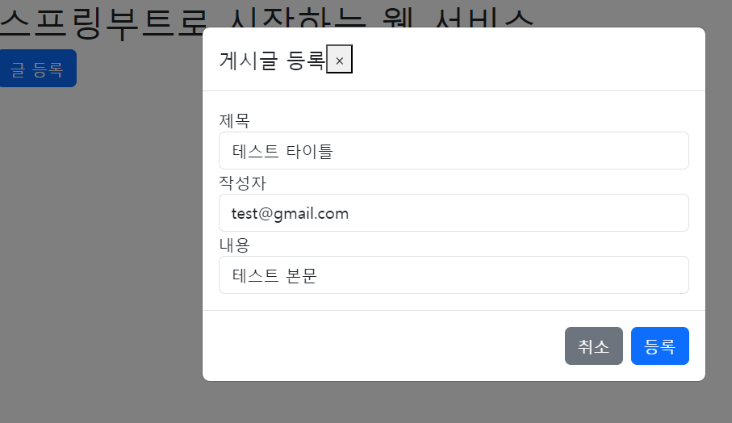
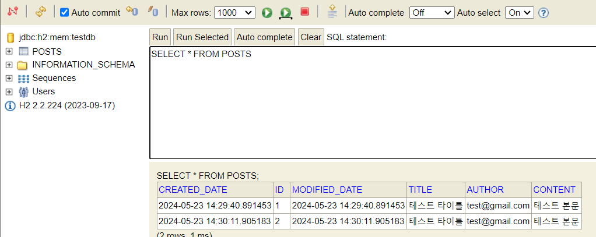

## 이동욱님의 스프링부트로 웹 서비스 출시하기를 보며 만든 프로젝트

---
## 프로젝트 생성


## WebRestController
- 응답을 정상적으로 하는지 간단하게 확인


### PostsSaveRequest
- setter를 사용하는 이유
  - Controller에서 `@RequestBody`로 외부에서 데이터를 받는 경우엔 **기본생성자** + **set메소드를 통해서만 값이 할당**된다.

## Entity 클래스로 Request/Response를 하지 않는 이유
- Entity 클래스는 매우 중요한 역할을 하는 클래스이다. 
- 다른 많은 클래스들이 Entity 클래스를 중심으로 동작을 하기 때문에 변경이 있어서는 안된다.
- Request나 Response용 DTO를 따로 만들어서 view에 맞는 스펙으로 운영해야한다.
- view Layer와 DB Layer를 역할 분리를 하는 것이 좋다.

### properties를 사용하지 않고 yml을 쓰는 이유
- 상대적으로 유연한 구조를 가졌기 때문이다.
- 계층 구조를 한눈에 쉽게 알아볼 수 있다.

### 처음에는 아무것도 없는 상태이다.


### PostsRequest.http 파일로 POST 요청을 보낸다.


다시 localhost:8080/h2-console을 확인하면 데이터가 정상적으로 입력된 것을 확인할 수 있다.


Entity는 유지보수를 위해 생성, 수정 시간 같은 데이터를 가지는데,
이를 개발자가 매번 업데이트 시키기에는 너무 많은 리소스가 들기 떄문에 JPA에서 자동으로 관리하도록 하겠다.
### BaseTimeEntity 생성
src/main/java/study/soowan/webservice/domain에 BaseTimeEntity 클래스를 생성
모든 Entity들의 상위 클래스가 되어 Entity들의 createdDate, modifiedDate를 자동으로 관리하는 역할
```java
@Getter
@MappedSuperclass
@EntityListeners(AuditingEntityListener.class)
public abstract class BaseTimeEntity {

    @CreatedDate
    private LocalDateTime createdDate;

    @LastModifiedDate
    private LocalDateTime modifiedDate;

}
```
- `@MappedSuperClass`
  - JPA Entity 클래스들이 BaseTimeEntity를 상속할 경우 필드들(`createdDate`, `modifiedDate`)도 컬럼으로 인식하도록 한다.
- `@EntityListeners(AuditingEntityListener.class`)
  - BaseTimeEntity 클래스에 Auditing 기능을 포함시킨다.
- `@CreatedDate`
  - Entity가 생성되어 자장될 때 시간이 자동 저장된다.
- `@LastModifiedDate`
  - 조회한 Entity의 값을 변경할 때 시간이 자동 저장된다.

Posts 클래스가 BaseTimeEntity를 상속받도록 변경
```java
...
public class Posts extends BaseTimeEntity {
    ...
}
```

이제 마지막으로 JPA Auditing 어노테이션들을 모두 활성화 시킬수 있도록 Application 클래스에 활성화 어노테이션을 추가한다.
```java
@EnableJpaAuditing // JPA Auditing 활성화
@SpringBootApplication
public class Application {

    public static void main(String[] args) {
        SpringApplication.run(Application.class, args);
    }
}
```
### JPA Auditing 테스트 코드 작성하기
```java
@Test
package study.soowan.webservice.web.domain.posts;

import org.aspectj.lang.annotation.After;
import org.junit.jupiter.api.Test;
import org.springframework.beans.factory.annotation.Autowired;
import org.springframework.boot.test.context.SpringBootTest;

import java.time.LocalDateTime;
import java.util.List;

import static org.assertj.core.api.Assertions.assertThat;

@SpringBootTest
class PostsRepositoryTest {

  @Autowired
  private PostsRepository postsRepository;

  @After("")
  public void cleanup() {
    postsRepository.deleteAll();
  }

  @Test
  void 게시글저장_불러오기() {
    ...
  }

  @Test
  void BaseTimeEntity_등록() {
    // given
    LocalDateTime now = LocalDateTime.now();
    postsRepository.save(Posts.builder()
            .title("테스트 게시글")
            .content("테스트 본문")
            .title("test@gmail.com")
            .build());

    // when
    List<Posts> postsList = postsRepository.findAll();

    // then
    Posts posts = postsList.get(0);
    assertThat(posts.getCreatedDate()).isAfter(now);
    assertThat(posts.getModifiedDate()).isAfter(now);
  }
}
```
테스트 코드를 실행시켜보면?
성공적으로 통과한다.


### PostRequest.http를 통해서 POST요청을 해보자
```.http request
POST http://localhost:8080/posts
Content-Type: application/json

{
"title": "테스트 타이틀",
"content": "테스트 본문",
"title": "테스터"
}
```

h2 console을 통해서 확인해보면

createdDate와 modifiedDate가 추가된 것을 확인할 수 있다.

앞으로 생성하는 Entity도 BaseTimeEntity를 상속받아서 생성, 수정시간을 자동으로 관리하게 할 수 있다.

## 뷰 템플릿엔진으로 Thymeleaf 사용
Spring에서 정식으로 지원하는 뷰 템플릿엔진으로 안정적인 서비스 지원을 받을 수 있고 Spring과 관련된 여러가지 기능들을 편리하게 사용가능하다.
- `네추럴 템플릿` : HTML 파일을 기반으로 작동한다.
- `표현식 문법` : 다양한 표현식을 사용하여 동적으로 값을 삽입하거나 조건부 로직을 구현할 수 있다.
- `Spring 통합` : spring MVC와 쉽게 통합된다. 컨트롤러에서 전달된 모델 데이터를 템플릿에서 간편하게 사용가능하다.

### 의존성 추가


### 메인 페이지 생성 
src/main/resources/templates에 main.html 파일을 생성한다.
```html
<!DOCTYPE HTML>
<html>
<head>
	<title>스프링부트 웹서비스</title>
	<meta http-equiv="Content-Type" content="text/html; charset=UTF-8" />
	<meta name="viewport" content="width=device-width, initial-scale=1" />

</head>
<body>
<h1>스프링부트로 시작하는 웹 서비스</h1>
</body>
</html>
```

메인페이지를 반환하는 controller를 만든다.
web패키지 안에 WebController를 만든다.
```java
@Controller
@AllArgsConstructor
public class WebController {

    @GetMapping("/")
    public String main() {
        return "main";
    }
}
```
prefix, sufix를 설정하지 않아도 Spring Boot의 자동 설정 기능 덕분에 정상적으로 html파일 리턴이 가능하다.

### 메인 페이지 테스트 코드
src/test/java/com/jojoldu/webservice/web에 WebControllerTest 클래스 생성
```java
@SpringBootTest(webEnvironment = RANDOM_PORT)
class WebControllerTest {
  @Autowired
  private TestRestTemplate restTemplate;

  @Test
  void 메인페이지_로딩() {
    // when
    String body = this.restTemplate.getForObject("/", String.class);


    // then
    assertThat(body).contains("스프링부트로 시작하는 웹 서비스");
  }
}
```
테스트가 무사히 통과되었다.
실제로 body가 잘 나오는지 확인해보겠다.

정상적으로 화면이 노출되는게 확인된다.

## 게시글 등록

---
화면에서 게시글 등록 기능을 구현한다.

### service 메소드 구현
src/main/java/study/soowan/webservice/ 아래에 service 패키지를 생성후, PostsService 클래스를 생성한다.
```java
@AllArgsConstructor
@Service
public class PostsService {

    private PostsRepository postsRepository;

    @Transactional
    public Long save(PostsSaveRequestDto dto) {
        return postsRepository.save(dto.toEntity()).getId();
    }
}
```
호출한쪽에서 게시글의 id를 알수있도록 리턴 타입을 Long으로 두고, `getId()`를 반환값으로 한다.
Service에서는 Entity 대신 Save용 DTO인 PostsSaveRequestDto를 받아서 저장한다.

DB 데이터를 등록/수정/삭제 하는 Service 메소드는 `@Transaction`을 필수적으로 가져간다.

만약 메소드에서 Exception이 발생하면 해당 메소드에서 이루어진 모든 DB작업을 초기화시킨다.
예) 만약 5개의 데이터를 등록해야하는데  3번째에서 Exception이 발생하면 앞의 2개의 데이터도 전부 롤백시킨다.

이제 Service 메소드를 테스트해보자!

src/**test**/java/study/soowan/webservice/service 패키지 생성후, PostServiceTest 클래스를 생성
```java
package study.soowan.webservice.service;

import org.aspectj.lang.annotation.After;
import org.junit.jupiter.api.Test;
import org.springframework.beans.factory.annotation.Autowired;
import org.springframework.boot.test.context.SpringBootTest;
import study.soowan.webservice.web.domain.posts.Posts;
import study.soowan.webservice.web.domain.posts.PostsRepository;
import study.soowan.webservice.web.dto.PostsSaveRequestDto;

import static org.assertj.core.api.Assertions.assertThat;

@SpringBootTest
class PostsServiceTest {

    @Autowired
    private PostsService postsService;

    @Autowired
    private PostsRepository postsRepository;

    @After("")
    void cleanup() {
        postsRepository.deleteAll();
    }

    @Test
    void Dto데이터가_posts테이블에_저장된다() {
        // given
        PostsSaveRequestDto dto = PostsSaveRequestDto.builder()
                .title("테스트 타이틀")
                .content("테스트")
                .title("test@gmail.com")
                .build();

        // when
        postsService.save(dto);

        // then
        Posts posts = postsRepository.findAll().get(0);
        assertThat(posts.gettitle()).isEqualTo(dto.gettitle());
        assertThat(posts.getContent()).isEqualTo(dto.getContent());
        assertThat(posts.getTitle()).isEqualTo(dto.getTitle());
    }
}
```
DTO가 service.save 메소드에 전다로디면, DB에 잘 저장되었는지 검증

테스트를 성공적으로 돌리기위해 PostsSaveRequestDto에 Builer를 추가
```java
...
public class PostsSaveRequestDto {
    private String title;
    
    ...
  
    @Builder
    public PostsSaveRequestDto(String title, String content, String author) {
        this.title = title;
        this.content = content;
        this.author = author;
    }

    public Posts toEntity() {
      ...
    }
}
```

테스트 코드가 잘 통과하였습니다.

WebRestController의 save 메소드도 service의 save로 교체한다.
```java
@RestController
@AllArgsConstructor
public class WebRestController {

    private PostsService postsService;

    ...

    @PostMapping("/posts")
    public void savePosts(@RequestBody PostsSaveRequestDto dto) {
        postsService.save(dto);
    }
}
```

## 입력화면
CSS는 부트스트랩의 도움을 받겠습니다.
부트스트랩, jQuery 등 프론트엔드 라이브러리를 사용할 수 있는 방법은 크게 2가지가 있다.
외부 CDN을 사용하는 것과, 직접 라이브러리를 다운받아서 사용하는 방법이다.

이 프로젝트는 CDN을 사용한다.
- 본인이 직업 다운받을 필요가없다. 사용법도 HTML/JPS/Thymeleaf에 코드만 한줄 추가하면 되서 간단하다.
- 하지만 실제 서비스에서는 잘 사용하지 않는다.
- **외부 서비스에 의존하는 경우이기 때문에 서비스를 제공하는 쪽에서 문제가 생기면 CDN을 사용하는 서비스도 문제가 생긴다.**

- bootstrap
  - Download 현재 버전에서 최신버전을 받는다.
  - dist 폴더 아래에 있는 css폴더에서 bootstrap.min.css를 src/main/resources/static/**css/lib**로 복사한다.
  - js파일도 마찬가지로 src/main/resources/static/**js/lib**로 복사한다.

- jQuery
  - `Download the compressed, production jQuery 3.x.x`을 클릭 복사합니다.
  - bootstrap.min.js와 같은 폴더에 jquery.min.js 파일을 생성하고 붙여넣기 합니다.


설정을 끝냈다면 아래와 같이 라이브러리를 추가합니다.
```html
<!DOCTYPE HTML>
<html>
<head>
	<title>스프링부트 웹서비스</title>
	...

	<!-- 부트스트랩 css 추가 -->
	<link rel="stylesheet" href="/css/lib/bootstrap.min.css"/>

</head>
<body>
...

<!-- 부트스트랩 js, jquery 추가 -->
<script src="/js/lib/jquery.min.js"></script>
<script src="/js/lib/bootstrap.min.js"></script>
</body>
</html>
```
css와 js 호출주소가 /로 시작하는데 이는 Spring Boot는 기본적으로 src/main/resource/static은 URL에서 `/`로 지정됩니다.
또한 css와 js의 위치가 서로 다릅니다.
css는 `<head>`에 js는 `<body>` 최하단에 두었습니다.
이유는 **페이지 로딩속도를 높이기 위함**입니다.

HTML은 최상단에서부터 코드가 실행되기 떄문에 **head가 다 실행되고 나서 body가 실행**됩니다.
즉, head가 다 불러지지 않으면 사용자 쪽에선 백지 화면만 노출됩니다.

추가로, bootstrap.js는 jquery가 꼭 있어야만 하기 때문에 bootstrap보다 먼저 호출되도록 코드를 작성했습니다.

글 등록을 클릭하면? 게시글 등록 모달이 정상적으로 출력됩니다.

모달창에 데이터를 입력하고 등록을 누르면? 등록 버튼의 기능을 아직 만들지 않아 아무 동작도 하지 않습니다.

src/main/resource/static/js/app에 main.js를 생성합니다.
```jquery-css
var main = {
    init : function () {
        var _this = this;
        $('#btn-save').on('click', function () {
            _this.save();
        });
    },
    save : function () {
        var data = {
            title: $('#title').val(),
            author: $('#author').val(),
            content: $('#content').val()
        };

        $.ajax({
            type: 'POST',
            url: '/posts',
            dataType: 'json',
            contentType:'application/json; charset=utf-8',
            data: JSON.stringify(data)
        }).done(function() {
            alert('글이 등록되었습니다.');
            location.reload();
        }).fail(function (error) {
            alert(error);
        });
    }
};

main.init();
```
이제 등록버튼을 누르면 데이터가 정상적으로 입력되는 것을 확인할 수 있습니다.


## 게시글 목록

---
게시글 목록 출력 기능을 만들겠습니다.

### 목록 출력
코드 작성 전에 한가지 해야할 일!
현재 사용중인 로컬 DB는 H2입니다. H2는 메모리 위에서 작동하기 때문에 프로젝트를 실행할 때 마다 자동으로 데이터가 삭제되기 때문에 `alter table`을 하지 않아도 되는 장점이 있습니다.
하지만 프로젝트 실행 시 항상 테이블이 깨끗한 상태이기 때문에 매번 데이터를 넣어줘야하는 번거로움이 있습니다.
이를 개선해보겠습니다.

게시글 목록의 UI가 잘 나오는지 확인/수정하는 과정에서 수동 데이터 입력 과정을 제외하기 위한 설정 작업을 진행합니다.
resources 아래에 아래와 같이 data-h2.sql 파일을 생성합니다.
```sql
insert into posts (id, title, author, content, created_date, modified_date) values (1, '테스트1', 'test1@gmail.com', '테스트1의 본문', now(), now());
insert into posts (id, title, author, content, created_date, modified_date) values (2, '테스트2', 'test2@gmail.com', '테스트2의 본문', now(), now());
```
위 insert sql 파일을 프로젝트 실행시에 자동으로 수행되도록 설정을 추가하겠습니다.
application.yml 코드를 아래와 같이 변경합니다.
`Spring Boot 3.x.x`대로 넘어오면서 `profile 설정`, `sql.init`등 이 달라졌으니 참고 부탁드립니다.
```yaml
spring:
  profiles:
    active: local

#local 환경
---
spring:
  config:
    activate:
      on-profile: local

  h2:
    console:
      enabled: true

  datasource:
    driver-class-name: org.h2.Driver
    url: jdbc:h2:mem:testdb
    username: sa
    password:

  application:
    name: spring-webservice

  jpa:
    show-sql: true
    hibernate:
      ddl-auto: create-drop
    defer-datasource-initialization: true

  sql:
    init:
      data-locations: classpath*:/data-h2.sql
```

특별히 **어플리케이션 실행시 파라미터로 넘어온게 없으면 active 값**을 보게됩니다.
운영 환경에선 real 혹은 production 등과 같은 profile을 보도록 jar 실행시점에 파라미터를 변경합니다.
local profile에서는 data-h2.sql이 실행되도록 지정하였습니다.

> Tip)</br>
> application.yml에서 ---를 기준으로 상단은 공통 영역이며, 하단이 각 profile의 설정 영역입니다. </br>
> 공통영역의 값은 각 profile환경에 동일한 설정이 있으면 무시되고, 없으면 공통영역의 설정값이 사용됩니다.</br>
> 만약 공통영역에 `jpa.hibernate.ddl-auto:create-drop`가 있고 운영 profile에 해당 설정값이 없다면 **운영환경에서 배포시 모든 테이블이 drop -> create**됩니다.</br>
> 이때문에 datasource, table 등과 같은 옵션들은 공통영역이 아닌 각 profile마다 별도로 두는것을 추천합니다.

설정이 끝났다면 h2-consol에서 초기 데이터가 들어온 것을 확인할 수 있습니다.


이제 실제 목록 출력에 관한 코드를 작성하겠습니다.
main.html의 UI를 변경합니다.
```html
<!DOCTYPE HTML>
<html xmlns:th="http://www.thymeleaf.org">
<head>
  <title>스프링부트 웹서비스</title>
  <meta http-equiv="Content-Type" content="text/html; charset=UTF-8"/>
  <meta name="viewport" content="width=device-width, initial-scale=1"/>

  <!--부트스트랩 css 추가-->
  <link rel="stylesheet" href="/css/lib/bootstrap.min.css">
</head>
<body>
<h1>스프링부트로 시작하는 웹 서비스</h1>

<div class="col-md-12">
  <button type="button" class="btn btn-primary" data-bs-toggle="modal" data-bs-target="#savePostsModal">글 등록</button>
  <br/>
  <br/>
  <!-- 목록 출력 영역 -->
  <table class="table table-bordered">
    <thead class=table>
    <tr>
      <th>게시글번호</th>
      <th>제목</th>
      <th>작성자</th>
      <th>최종수정일</th>
    </tr>
    </thead>
    <tbody id="tbody">
    <tr th:each="post : ${posts}">
      <td th:text="${post.id}"></td>
      <td th:text="${post.title}"></td>
      <td th:text="${post.author}"></td>
      <td th:text="${#temporals.format(post.modifiedDate, 'yyyy-MM-dd HH:mm:ss')}"></td>
    </tr>
    </tbody>
  </table>
</div>

<!-- Modal 영역 -->
<div class="modal fade" id="savePostsModal" tabindex="-1" aria-labelledby=savePostsModal aria-hidden="true">
  <div class="modal-dialog" role="document">
    <div class="modal-content">
      <div class="modal-header">
        <h5 class="modal-title" id="savePostsLabel">게시글 등록</h5>
        <button type="button" class="close" data-bs-dismiss="modal" aria-label="Close">
          <span aria-hidden="true">&times;</span>
        </button>
      </div>
      <div class="modal-body">
        <form th:object="${postsRequest}">
          <div class="form-group">
            <label for="title">제목</label>
            <input type="text" class="form-control" th:field="*{title}" id="title" placeholder="제목을 입력하세요">
          </div>
          <div class="form-group">
            <label for="author">작성자</label>
            <input class="form-control" th:field="*{author}" id="author" placeholder="작성자를 입력하세요">
          </div>
          <div class="form-group">
            <label for="content">내용</label>
            <input class="form-control" th:field="*{content}" id="content" placeholder="내용을 입력하세요">
          </div>
        </form>
      </div>
      <div class="modal-footer">
        <button type="button" class="btn btn-secondary" data-bs-dismiss="modal">취소</button>
        <button type="button" class="btn btn-primary" id="btn-save">등록</button>
      </div>
    </div>
  </div>
</div>

<!--부트스트랩 js, jquery 추가-->
<script src="/js/lib/jquery.min.js"></script>
<script src="/js/lib/bootstrap.min.js"></script>

<!-- custom js 추가 -->
<script src="/js/app/main.js"></script>
</body>
</html>
```
타임리프를 사용하기 위해서 xmlns:th="http://www.thymeleaf.org"> 추가

`th:each`를 사용해서 리스트를 순회하면서 하나씩 꺼내 각각의 필드값을 채워서 테이블에 출력합니다.

기존에 있던 PostsRepository 인터페이스에 쿼리가 추가됩니다.
```java
public interface PostsRepository extends JpaRepository<Posts, Long> {

    @Query("SELECT p " +
            "FROM Posts p " +
            "ORDER BY p.id DESC")
    Stream<Posts> findAllDesc();
}
```
위 코드는 SpringDataJPA가 제공하는 기본 메소드만으로도 해결이 가능하지만 굳이 `@Query`를 사용한 이유는 SpringDataJPA에서 제공하지 않는 메소드는 위처럼 쿼리로 작성해도 되는것을 보여주기 위함입니다.

Repository 다음으로 PostsService 코드를 변경하겠습니다.
```java
@AllArgsConstructor
@Service
public class PostsService {

    private PostsRepository postsRepository;

    ...

    @Transactional(readOnly = true)
    public List<PostsMainResponseDto> findAllDesc() {
        return postsRepository.findAllDesc()
                .map(PostsMainResponseDto::new)
                .collect(Collectors.toList());
    }
}
```

findAllDesc 메소드의 트랜잭션 어노테이션(`@Transactional`)에 옵션이 하나 추가되었습니다.
옵션(`readOnly = true`)을 주면 트랜잭션 범위는 유지하되, **조회 기능만 남겨두어 조회 속도가 개선**되기 때문에 특별히 등록/수정/삭제 기능이 없는 메소드에선 사용하시는걸 추천드립니다.

PostsMainResponseDto 클래스가 없기 때문에 생성해줍니다.
src/main/study/soowan/webservice/web/dto
```java
@Getter
public class PostsMainResponseDto {
  private Long id;
  private String title;
  private String author;
  private LocalDateTime modifiedDate;

  public PostsMainResponseDto(Posts entity) {
    id = entity.getId();
    title = entity.getTitle();
    author = entity.getAuthor();
    modifiedDate = entity.getModifiedDate();
  }
}
```
타임 리프를 사용하면 타임리프 자체 `#Temporals.format()` 함수를 사용하여 간편하게 View로 넘어온 자바의 LocalDateTime을 변환할 수 있습니다.

마지막으로 Controller를 변경합니다.
기존에 생성해둔 WebController 클래스를 아래와 같이 변경합니다.
```java
@Controller
@AllArgsConstructor
public class WebController {

    private PostsService postsService;

    @GetMapping("/")
    public String main(Model model) {
        model.addAttribute("postsRequest", new PostsSaveRequestDto());
        model.addAttribute("posts", postsService.findAllDesc());
        return "main";
    }
}
```
브라우저를 통해서 확인해보겠습니다.

